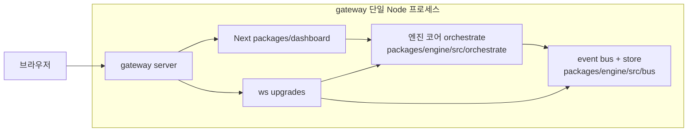

# 게이트웨이 통합 아키텍처 설계안

> **상태**: 설계 확정(2026-04-23). 구현 플랜은 `docs/superpowers/plans/2026-04-23-gateway-unification.md`.
> **목적**: HTTP·WS **호스트**(`packages/gateway`)와 엔진 **코어**(`packages/engine/src/orchestrate`)를 구분하고, 패키지 3분할·SSE 제거·WebSocket 이벤트 + WS-RPC·재연결 전략을 한 문서로 고정한다.

---

## 1. 한 줄 요약

- 오케스트레이션 **코어 디렉터리**는 `packages/engine/src/orchestrate`이다. (`packages/gateway`는 프로세스 호스트 패키지명과 혼동되지 않도록 코어 폴더명은 `orchestrate`를 쓴다.)
- **패키지는 3분할**: `packages/engine`(순수 코어, 브라우저·Next 의존 없음) + `packages/gateway`(HTTP + WS + Next 호스트) + `packages/dashboard`(Next 앱).
- **SSE 제거**: 서버→클라이언트 푸시는 **WebSocket 이벤트**만 사용한다.
- **액션(사이드 이펙트)**은 HTTP POST 나열이 아니라 **WebSocket RPC**(`req` / `res`)로 통일한다.
- **재연결**: 전송 계층 끊김 시 지수 백오프 + 스냅샷 + `lastSeq` replay(event store 기반). `run`/`idle` 같은 앱 상태 때문에 소켓을 의도적으로 끊지 않는다.
- **토폴로지(하이브리드)**: 글로벌 이벤트 + RPC는 `/ws/gateway` 단일 소켓으로 멀티플렉스. per-resource 스트림(`/ws/terminal`, `/ws/task-terminal/:id`, `/ws/task-logs/:id`)은 기존 엔드포인트 유지.

---

## 2. 현재 상태와 목표

### 2.1 현재

- 개발 시 `packages/dashboard/server.ts`가 `http.createServer` + Next `getRequestHandler` + 여러 `WebSocketServer`의 `upgrade`로 **한 포트**에서 페이지·API·WS를 함께 제공한다.
- `packages/dashboard/package.json`의 `start`는 `next start`라 **프로덕션에서는 커스텀 서버가 빠진다**(WS upgrade 핸들러 전부 동작 안 함).
- `packages/engine` deps는 3개(`better-sqlite3`, `gray-matter`, `tsx`)만 있어 순수한 상태.
- SSE는 `packages/dashboard/src/app/sse/route.ts`와 `SseProvider`/`client.ts`/`useSseHandlers.ts`로 구성. DB 폴링 + `replayAfter` 타임스탬프 커서.

### 2.2 목표

| 구분 | 내용 |
|------|------|
| 용어 | 코어: `packages/engine/src/orchestrate`. `packages/dashboard`·`packages/gateway`의 `tsconfig` paths에 `@/orchestrate/*` → `../engine/src/orchestrate/*` (또는 동일 상대경로). |
| 패키지 경계 | **3분할**. `engine` 패키지는 브라우저/Next 의존 금지. `gateway`가 Next + WS + HTTP 호스트. `dashboard`는 Next 앱 디렉터리. |
| 실행 | 리스닝 프로세스를 `packages/gateway`에 두고, 루트 `cli.js`에 `orchestrate gateway`를 추가(`start`/`dashboard`는 위임). |
| 실시간 | SSE 완전 제거. `orchestration-status`, `task-changed` 등 **브라우저로의 푸시는 WS 이벤트**만. 내부 pub/sub(`packages/engine/src/lib/sse/` → **rename `bus/`**)은 유지하되 브라우저 팬아웃은 WS 한 경로. |
| 액션 | UI·사용자의 변경 동작은 **WS-RPC**. 프레이밍은 기존 `/ws/orchestrate`의 `orchestrate.start` / `stop`과 동일한 `req`/`res` 패턴을 표준으로 확장하고 `method` 메타에 `idempotent: boolean` 명시. |
| 전송 vs 앱 상태 | **원칙 A**: `running`/`idle` 전환으로 WS를 닫지 않는다. **원칙 B**: 네트워크·재시작 등으로 끊기면 **자동 재연결**한다. React `useEffect`가 상태 변화마다 소켓을 재생성하지 않도록 점검한다. |

### 2.3 소켓 토폴로지(확정)

**하이브리드**:

- **`/ws/gateway`** — 글로벌 이벤트(`orchestration-status`, `task-changed` 등) + WS-RPC(`orchestrate.start`, `orchestrate.stop`, 향후 확장)를 단일 소켓으로 멀티플렉스.
- **`/ws/terminal`** — 전역 인터랙티브 터미널(node-pty). 기존 유지.
- **`/ws/task-terminal/:id`** — 태스크별 JSONL 대화 스트림. 기존 유지.
- **`/ws/task-logs/:id`** — 태스크별 로그 tail. 기존 유지.

이유: per-resource 스트림은 라이프사이클(생성·종료·백프레셔)이 resource 단위로 깔끔하고, 멀티플렉스로 합치면 프레이밍·플로우 컨트롤이 복잡해진다. 글로벌 채널만 합쳐도 "한 번의 재연결로 주 상태 복구"라는 핵심 가치는 달성된다.

---

## 3. WebSocket과 엔진 `run` / `idle`

- **원칙 A (앱 상태)**: 오케스트레이션이 `running`이든 `idle`이든 **의도적으로 WS를 닫아서 상태를 바꾸지 않는다**. `run` ↔ `idle`은 애플리케이션 상태만 변경한다.
- **원칙 B (전송 장애)**: 끊기면 클라이언트는 **재연결**한다(§5).
- **참고(현재 서버)**: `packages/dashboard/server.ts`의 `/ws/orchestrate`는 연결 후 `ready`를 보내고, `orchestrate.start` / `orchestrate.stop`에 대해 `{ type: "res", ... }`로 응답하며 **성공 시 소켓을 닫지 않는다**.

---

## 4. SSE → WebSocket 이전 범위

### 4.1 제거·대체 대상(대표)

- 라우트: `packages/dashboard/src/app/sse/route.ts` (`GET /sse`, DB 폴링, replay, 스냅샷 푸시).
- 클라이언트: `packages/dashboard/src/providers/SseProvider.tsx`, `packages/dashboard/src/sse/client.ts`, `packages/dashboard/src/providers/useSseHandlers.ts`.
- 레이아웃: `SseProvider` 마운트 제거 → **단일 WS 클라이언트**(`GatewayWsProvider`)로 대체.

### 4.2 서버

- SSE에 있던 **스냅샷 + 라이브 구독 + 누락 replay** 로직을 `/ws/gateway` 핸들러로 이전한다.
- 연결 직후 **스냅샷**(orchestration 상태 + tasks full) 전송 후, `publish`된 이벤트를 **seq를 부여하여** 연결된 클라이언트에 브로드캐스트한다.
- 기존 DB 폴링(1초 주기 `MAX(updated)` 체크)은 **제거**하고, task-store의 쓰기 경로에서 명시적으로 `publish("task-changed", ...)`를 호출하도록 일원화한다.

### 4.3 Replay — `lastSeq` 기반 재설계

SSE의 DB 폴링 + 타임스탬프 커서 방식은 **이식하지 않는다**. 대신:

- **event store 신규 구축**: `packages/engine/src/bus/event-store.ts`.
- `publish()` 시 **단조 증가 seq**를 부여하고 링버퍼(최대 5000개, TTL 30분 등 구성 가능)에 저장.
- 클라이언트 재연결 시 최초 메시지로 `{ type: "hello", lastSeq?: number }`를 보내고, 서버는 `lastSeq` 이후 누락 이벤트를 `{ type: "replay", events: [...] }`로 일괄 전송 후 실시간 스트림 합류.
- `lastSeq`가 링버퍼 범위를 벗어난 경우 `{ type: "replay-gap" }`을 보내 클라이언트가 스냅샷 재요청으로 fallback.

### 4.4 내부 pub/sub 이름 정리

`packages/engine/src/lib/sse/`는 SSE 제거 후 네이밍이 오해를 준다. 본 작업에서 **`packages/engine/src/bus/`로 rename**(import 경로 일괄 치환). 외부 전송과 무관한 내부 이벤트 버스임을 드러낸다.

---

## 5. 끊김 시 재연결 전략(클라이언트)

- **백오프**: 지수 백오프 + jitter, **상한**(예: 30초). `onopen`에서 백오프 타이머 리셋.
- **트리거**: `onclose`, `onerror`, heartbeat 타임아웃(서버 `tick` 또는 앱 레벨 ping/pong 미수신).
- **재연결 후**: 첫 메시지로 `{ type: "hello", lastSeq }` 전송 → 서버가 `replay` 또는 `replay-gap` 회신 → `replay-gap`이면 클라이언트가 스냅샷 refetch.
- **중복 방지**: 이벤트에 `seq`를 두고, 이미 처리한 seq는 무시.
- **가시성(선택)**: `document.visibilitychange` 시 ping으로 drift 보정.
- **진행 중 RPC**: 재연결 순간 **응답 대기 중인 `req.id`** 처리는 method별 `idempotent` 메타로 분기(아래 §6.2).

---

## 6. WS 수신(이벤트) + WS-RPC(액션)

### 6.1 수신(서버 → 클라이언트) — `/ws/gateway`

- 연결 직후 스냅샷 + `lastSeq` 이후 replay.
- 라이브 이벤트: `orchestration-status`, `task-changed`, 기타 `publish` 소스.
- UI는 가능한 한 **구독만** 하고, 액션은 RPC로 분리한다.

### 6.2 액션(클라이언트 → 서버) — `/ws/gateway`

최소 스키마:

- 요청: `{ type: "req", id: string, method: string, params?: object }`
- 응답: `{ type: "res", id: string, ok: boolean, payload?: unknown, error?: string | object }`

**메서드 메타(서버 측 레지스트리)**:

```ts
interface RpcMethodDef<P, R> {
  name: string;            // 예: "orchestrate.start"
  idempotent: boolean;     // 재연결 시 클라이언트 자동 재전송 허용 여부
  paramsSchema: z.ZodType<P>;
  handler: (params: P) => Promise<R>;
}
```

**현재 존재하는 메서드**:

| method | idempotent | 재연결 시 정책 |
|---|---|---|
| `orchestrate.start` | false | 자동 재전송 금지. 클라이언트는 in-flight id 타임아웃 후 스냅샷으로 상태 확인. |
| `orchestrate.stop` | true | 자동 재전송 허용. 서버는 이미 멈춰있으면 성공 응답. |

향후 RPC 추가 시 `idempotent` 메타를 반드시 정의해야 한다.

### 6.3 HTTP와의 관계

- 초기 로드·정적 자산·(선택) REST **조회**는 Next HTTP로 유지 가능하다.
- **변경 계열(POST/PUT/DELETE)**은 WS-RPC로 이전하는 것을 목표로 한다. 본 플랜에서는 `orchestrate.start`/`stop`만 WS로 완전 이전하고, 나머지 REST 변경 route들의 RPC 이전은 후속 작업으로 분리(별도 플랜).

### 6.4 보안 1차 스코프

- **Origin 검증**: `/ws/gateway` 및 모든 WS upgrade에서 `req.headers.origin`을 허용 목록(`http://localhost:<PORT>`, `http://127.0.0.1:<PORT>`)과 비교해 불일치 시 upgrade 거절. cross-origin WebSocket hijacking 차단.
- **RPC param 스키마 검증**: `gateway` 단일 진입점에서 메서드별 zod 스키마로 검증. 스키마 실패 시 `{ ok: false, error: { code: "INVALID_PARAMS", ... } }` 응답.
- **Auth**: 현 단계는 loopback 전제. 원격/토큰 인증은 후속(별도 플랜).

---

## 7. 프로세스 관점 다이어그램



---

## 8. 구현 단계(개요)

상세 태스크·커밋 단위는 `docs/superpowers/plans/2026-04-23-gateway-unification.md`에 있다. 큰 단계만 정리:

### Phase 1 — 구조: 3분할 + rename

1. `packages/engine/src/engine` → `src/orchestrate` (git mv, import 일괄 치환). *(중간에 `src/gateway`를 거친 이력이 있으면 `src/orchestrate`로 한 번 더 이동해 호스트 패키지명과 구분.)*
2. `@/engine/*` alias → `@/orchestrate/*` (dashboard·gateway 패키지 `tsconfig` paths).
3. `packages/gateway` 신설. `packages/dashboard/server.ts`를 `packages/gateway/src/server.ts`로 이전. Next 앱 디렉터리 해석은 `PACKAGE_DIR`/`PROJECT_ROOT` 우선순위로 고정.
4. `cli.js`에 `orchestrate gateway` 추가, `start`/`dashboard`는 위임.
5. `packages/dashboard/package.json`의 `dev`는 gateway 엔트리로 연결, `start`도 동일(프로덕션).

### Phase 2 — bus 리네임 + event store

6. `packages/engine/src/lib/sse/` → `src/bus/` (rename + import 치환).
7. `bus/event-store.ts` 신설: seq 발행기 + 링버퍼. `publish()` 경로에서 write-through.
8. DB 폴링 제거 대체: task-store 쓰기 경로에서 명시적 `publish("task-changed", ...)`.

### Phase 3 — `/ws/gateway` + SSE 제거(단일 PR)

9. `gateway/src/ws/gateway-channel.ts` 신설: 연결 핸들러, 스냅샷, `hello`/`replay`/`replay-gap`, RPC 레지스트리.
10. RPC 레지스트리에 `orchestrate.start`(idempotent=false) / `orchestrate.stop`(idempotent=true) 등록. 기존 `/ws/orchestrate`는 **제거**하고 클라이언트를 `/ws/gateway`로 이전.
11. 클라이언트: `GatewayWsProvider` 신설(`packages/dashboard/src/gateway-ws/provider.tsx`), 백오프·seq·in-flight RPC·idempotent 재전송 규칙 구현.
12. `SseProvider`·`useSseHandlers`·`src/sse/`·`src/app/sse/route.ts` 제거, 레이아웃에서 `GatewayWsProvider`로 교체.
13. `useSseHandlers`의 React Query invalidate / Zustand patch 로직을 WS 이벤트 핸들러로 이전.

### Phase 4 — 보안 레이어

14. WS upgrade 단계에서 origin 검증 공통 유틸(`gateway/src/ws/verify-origin.ts`) 도입, 전 엔드포인트 적용.
15. RPC 레지스트리에 zod 스키마 필드 추가, 진입점에서 검증.

### Phase 5 — 프로덕션 부팅

16. `packages/dashboard/package.json`의 `start`를 `next start`에서 gateway 엔트리로 변경. `next build` 후 `next({ dev: false }).getRequestHandler()`로 한 포트 유지.
17. 프로덕션 부팅 스모크: 빌드 → 기동 → 페이지·`/ws/gateway`·태스크별 WS·터미널 스모크.

### Phase 6 — 문서·검증

18. `docs/architecture/orchestrator-node-architecture.md` 재작성(옛 `src/frontend/...` 경로 제거, 게이트웨이 용어 반영, SSE 섹션 삭제).
19. 스모크: 대시보드 로딩 + `/ws/gateway`(이벤트+RPC) + 태스크 로그/터미널 + WS abort 후 백오프·스냅샷·seq 정합.
20. `packages/engine`, `packages/gateway` 타입체크.
21. Storybook, Playwright e2e 회귀 확인.

---

## 9. 산출물·파일 요약

| 분류 | 경로 |
|------|------|
| 이동 | `packages/engine/src/engine/**` → `packages/engine/src/orchestrate/**` |
| 이동 | `packages/engine/src/lib/sse/**` → `packages/engine/src/bus/**` |
| 이동 | `packages/dashboard/server.ts` → `packages/gateway/src/server.ts` |
| 신규 | `packages/gateway/{package.json, tsconfig.json, src/server.ts, src/ws/gateway-channel.ts, src/ws/verify-origin.ts, src/rpc/registry.ts, src/rpc/methods/*}` |
| 신규 | `packages/engine/src/bus/event-store.ts` |
| 신규 | `packages/dashboard/src/gateway-ws/{provider.tsx, client.ts, handlers.ts}` |
| 제거 | `packages/dashboard/src/app/sse/route.ts`, `packages/dashboard/src/providers/SseProvider.tsx`, `packages/dashboard/src/providers/useSseHandlers.ts`, `packages/dashboard/src/sse/client.ts` |
| 변경 | `cli.js`(gateway 커맨드), `packages/dashboard/package.json`(dev/start), `packages/dashboard/tsconfig.json`(alias), 전 `@/engine/`·`@/orchestrate/` import |
| 변경 | `docs/architecture/orchestrator-node-architecture.md` |

---

## 10. 결정 로그

2026-04-23 사용자와 합의한 결정(플랜 재작성 근거):

1. **패키지 분할**: 3분할(engine/gateway/dashboard). 2분할 합체 대신 경계 명확화.
2. **소켓 토폴로지**: 하이브리드. 글로벌 `/ws/gateway` + per-resource 엔드포인트 유지.
3. **Replay**: `lastSeq` + event store. SSE의 DB 폴링 이식 안 함.
4. **in-flight RPC**: `run`=재전송 금지, `stop`=재전송 허용. 계약에 `idempotent` 메타 표준화.
5. **SSE→WS 마이그레이션**: 한 PR 스왑(이중 publish 과도기 없음). loopback 단일 사용자 전제.
6. **프로덕션 부팅**: 커스텀 서버 + `next({ dev: false }).getRequestHandler()`로 한 포트 유지. standalone 사용 안 함.
7. **보안 1차 스코프**: origin 검증 + RPC param 스키마 검증(gateway 단일 지점). 토큰 인증은 후속.

---

## 11. 관련 기존 파일(구현 시 참고)

- 게이트웨이 호스트(현재): `packages/dashboard/server.ts`
- SSE 라우트: `packages/dashboard/src/app/sse/route.ts`
- 이벤트 버스(현재): `packages/engine/src/lib/sse/` (→ rename `bus/`)
- 오케스트레이션 상태 푸시 import: `@/orchestrate/orchestration-manager` 등. 구현 파일은 `packages/engine/src/orchestrate/orchestration-manager.ts` 또는 `orchestrate/managers/orchestration-manager.ts` 등 레이아웃에 따름(중복 루트·managers 정리는 별도 태스크).
