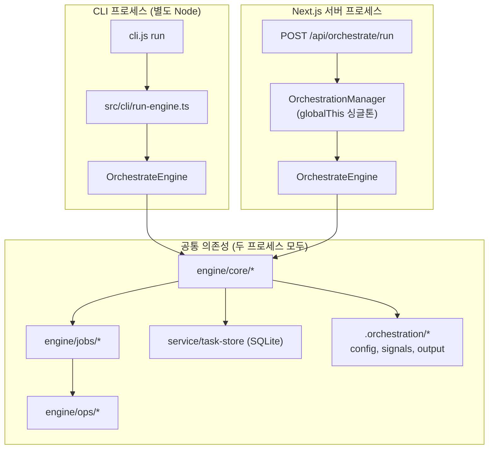
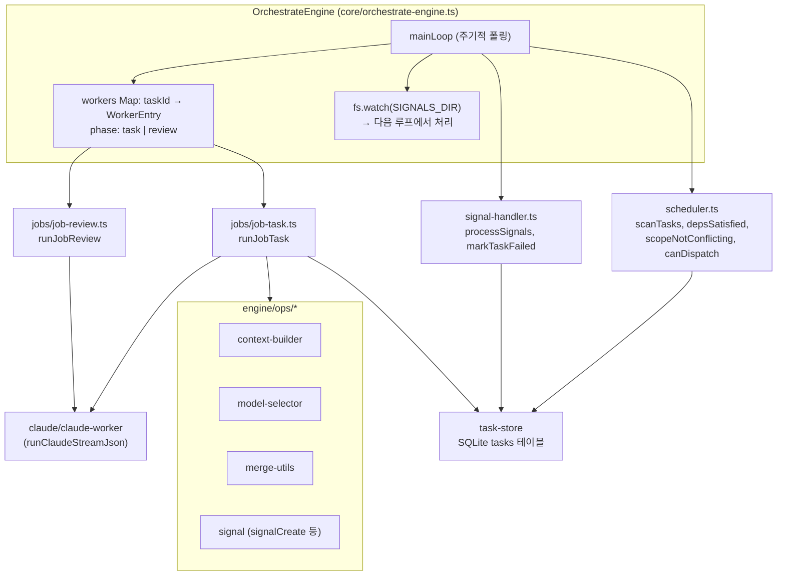
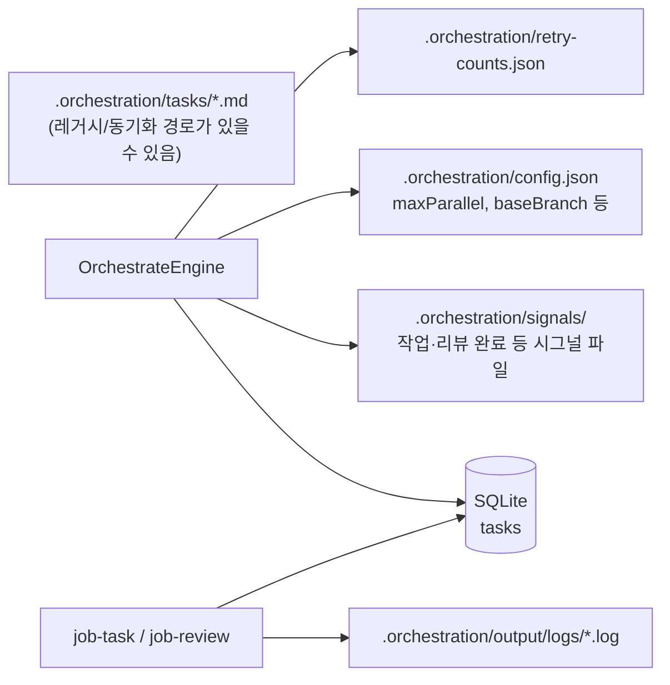
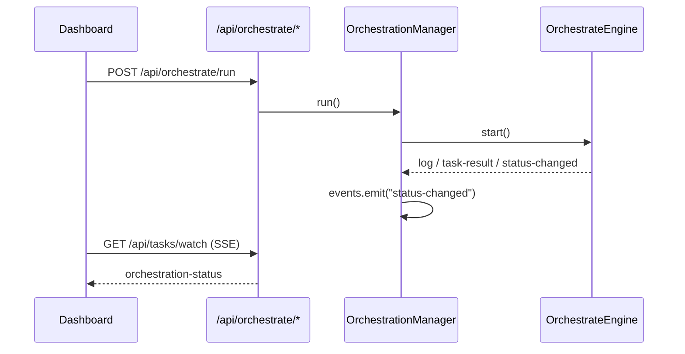

# 오케스트레이터 아키텍처 (Node.js 관점)

> 기준: `OrchestrateEngine`이 메인 파이프라인을 담당하며, 예전 `orchestrate.sh` 감독 역할은 Node 엔진으로 이전된 상태를 기준으로 한다.
>
> **⚠ 마이그레이션 중**: 본 문서는 **현재(engine 네이밍 + SSE) 상태**를 설명한다. 게이트웨이 통합 아키텍처(`docs/architecture/gateway-unified-architecture-plan.md`, 2026-04-23 확정) 시행 후 본 문서는 전면 재작성 예정(`docs/superpowers/plans/2026-04-23-gateway-unification.md` Phase 6). 주요 변화: `engine` → `gateway`, SSE 제거(→ `/ws/gateway`), `packages/gateway-host` 신설.

## 1. 프로세스 경계

동일한 `OrchestrateEngine` 클래스를 쓰지만, **시작 경로에 따라 프로세스가 갈린다.**

| 진입점                                 | 역할                                                         |
| ----------------------------------- | ---------------------------------------------------------- |
| `node cli.js run` → `run-engine.ts` | 터미널에서 단독 실행. `OrchestrationManager` 없이 엔진만 기동.             |
| `POST /api/orchestrate/run`         | 대시보드에서 실행. `OrchestrationManager`가 로그·실행 이력·SSE용 이벤트를 감싼다. |

---

## 2. 엔진 내부 레이어

`OrchestrateEngine`은 **얇은 조율자**이고, 스케줄·시그널·실제 작업은 아래 모듈로 나뉜다.

**주기 동작 요약**

1. `mainLoop`: 설정 핫 리로드(일정 루프마다) → `processSignals` → 대기 큐에서 `maxParallel`까지 `startTask`.
2. `startTask` / `startReview`: `AbortController`와 함께 비동기 `runJobTask` / `runJobReview`를 돌리고 `workers`에 등록.
3. `healthCheck`: 장시간(예: 30분) 워커는 abort 후 `markTaskFailed`.
4. 엔진 기동 시 `in_progress` 고아 태스크는 좀비로 간주해 `failed` 처리.

---

## 3. 데이터와 진실 공급원

엔진과 잡은 `**task-store`의 SQLite**를 읽고 태스크 상태를 갱신한다. 시그널 디렉터리는 리뷰 재시도·완료 통지 등 **파일 기반 핸드셰이크**에 사용된다.

---

## 4. UI ↔ 서버 이벤트 (Next 프로세스만)

대시보드가 같은 Node 프로세스에 있을 때:

CLI로만 `run-engine.ts`를 띄운 경우에는 이 SSE 경로 없이 **표준 출력 로그**로만 관찰한다.

---

## 5. 관련 소스 경로 (빠른 탐색)

| 영역          | 경로                                                                     |
| ----------- | ---------------------------------------------------------------------- |
| 엔진 코어       | `packages/orchestration-runtime/src/engine/core/orchestrate-engine.ts` |
| 스케줄러        | `packages/orchestration-runtime/src/engine/core/scheduler.ts`          |
| 시그널 처리      | (시그널 파일 제거 진행중 — `docs/superpowers/plans/2026-04-20-remove-signal-files.md`) |
| 태스크/리뷰 잡    | `packages/orchestration-runtime/src/engine/jobs/job-task.ts`, `job-review.ts` |
| Claude 실행   | `packages/orchestration-runtime/src/engine/claude/claude-worker.ts`    |
| OPS 유틸      | `packages/orchestration-runtime/src/engine/ops/*`                      |
| API 래퍼      | `packages/orchestration-runtime/src/engine/orchestration-manager.ts` (루트 버전. `managers/` 하위 동명 파일 있으나 `server.ts`는 루트를 사용) |
| CLI 엔트리     | `packages/orchestration-runtime/src/cli/run-engine.ts`                 |
| WS 호스트(현재)  | `apps/dashboard/server.ts` (→ `packages/gateway-host/src/server.ts` 이전 예정) |
| 오케스트레이션 WS | `apps/dashboard/server.ts`의 `/ws/orchestrate` (run/stop RPC. → `/ws/gateway`로 통합 예정) |

