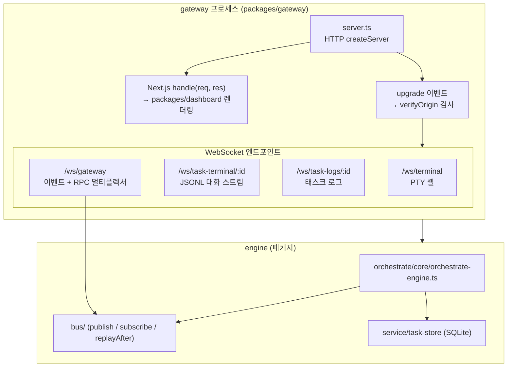
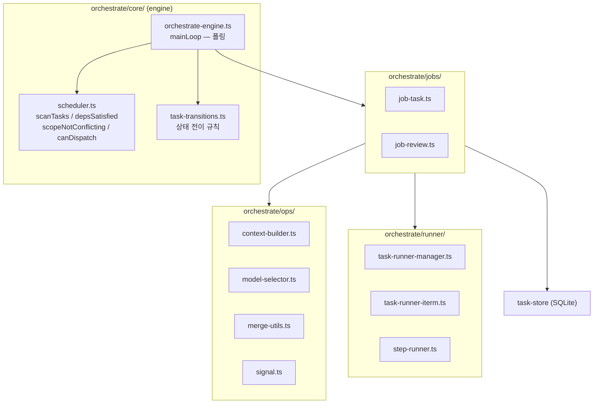
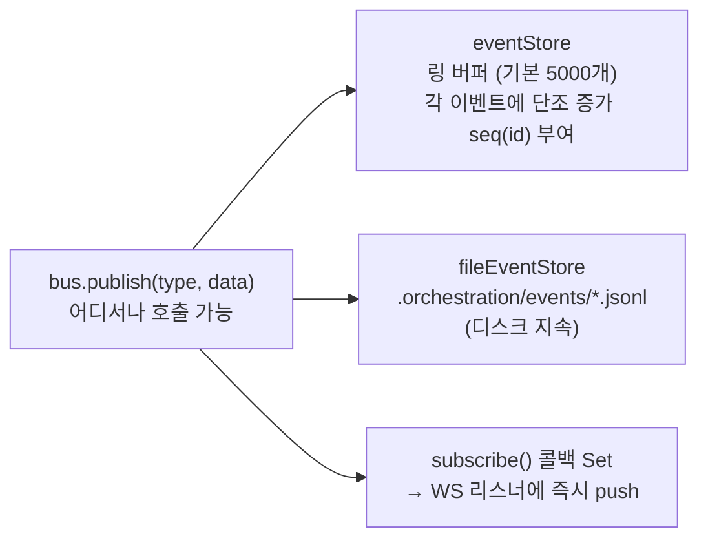
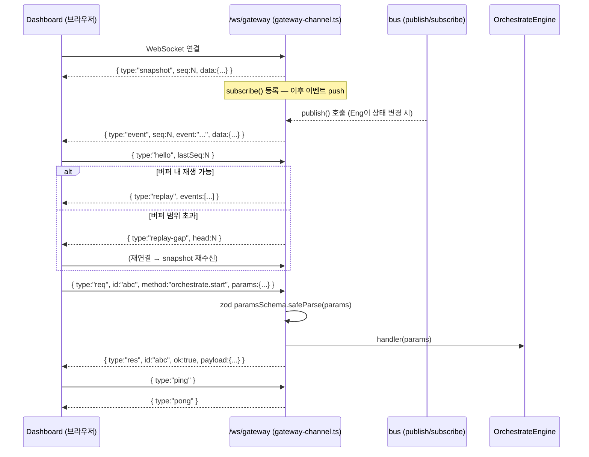

# 오케스트레이터 아키텍처 (게이트웨이 통합 이후)

> 기준: `gateway-unification` 완료 상태. `packages/gateway`가 단일 HTTP + WS 호스트 프로세스를 담당하며, `packages/dashboard`는 순수 Next.js 앱(서버 코드 없음)으로 분리된 상태를 기준으로 한다.

## 1. 프로세스 경계

단일 `gateway` 프로세스가 Next.js 렌더링, WebSocket 업그레이드, 오케스트레이션 엔진을 모두 담당한다.

| 진입점 | 역할 |
|--------|------|
| `packages/gateway/src/server.ts` | HTTP 서버 기동, Next.js 앱 연결, WS 업그레이드 라우팅 |
| `packages/dashboard` | 순수 Next.js 앱 (API Routes 포함). `server.ts` 없음 |
| `/ws/gateway` | 이벤트 구독 + RPC 단일 채널 |

---

## 2. 내부 레이어

`OrchestrateEngine`은 얇은 조율자이고, 스케줄·잡·실행은 아래 모듈로 나뉜다.

**주기 동작 요약**

1. `mainLoop`: 설정 핫 리로드(일정 루프마다) → `processSignals` → 대기 큐에서 `maxParallel`까지 `startTask`.
2. `startTask` / `startReview`: `AbortController`와 함께 비동기 `runJobTask` / `runJobReview`를 돌리고 `workers`에 등록.
3. `healthCheck`: 장시간(예: 30분) 워커는 abort 후 `markTaskFailed`.
4. 엔진 기동 시 `in_progress` 고아 태스크는 좀비로 간주해 `failed` 처리.

---

## 3. 이벤트 버스

**링 버퍼 특성**

- 이벤트 ID(`seq`)는 단조 증가 정수. `head()` = 최신 ID, `tail()` = 버퍼 내 가장 오래된 ID.
- `readAfter(lastSeq)`: `lastSeq` 이후 이벤트 배열 반환. 버퍼 밖이면 빈 배열(클라이언트가 스냅샷 재요청해야 함).
- 버퍼 용량 초과 시 가장 오래된 이벤트부터 만료(`buf.shift()`).

---

## 4. UI ↔ 서버 통신 (`/ws/gateway`)

`/ws/gateway` 단일 채널이 이벤트 스트림과 RPC를 모두 처리한다.

**메시지 타입 요약**

| 방향 | 타입 | 설명 |
|------|------|------|
| 서버→클라 | `snapshot` | 연결 직후 현재 전체 상태 + 최신 seq |
| 서버→클라 | `event` | 실시간 이벤트 (bus.publish 발생 즉시) |
| 서버→클라 | `replay` | hello 응답 — 놓친 이벤트 배열 |
| 서버→클라 | `replay-gap` | 버퍼 범위 초과 — 클라이언트 스냅샷 재요청 필요 |
| 서버→클라 | `res` | RPC 응답 (id 매핑) |
| 서버→클라 | `pong` | ping 응답 |
| 클라→서버 | `hello` | 재연결 시 `lastSeq` 전달 |
| 클라→서버 | `req` | RPC 호출 `{ type, id, method, params }` |
| 클라→서버 | `ping` | keep-alive |

**Origin 검증**

모든 WS 업그레이드 요청은 `verifyOrigin`을 통과해야 한다. 허용 Origin: `http://localhost:PORT` / `http://127.0.0.1:PORT`. Origin 헤더가 없는 경우 개발 환경에서만 허용(프로덕션 차단).

---

## 5. 소스 경로 테이블

| 영역 | 경로 |
|------|------|
| HTTP + WS 호스트 진입점 | `packages/gateway/src/server.ts` |
| `/ws/gateway` 채널 | `packages/gateway/src/ws/gateway-channel.ts` |
| Origin 검증 | `packages/gateway/src/ws/verify-origin.ts` |
| RPC 타입 정의 | `packages/gateway/src/rpc/types.ts` |
| RPC 레지스트리 | `packages/gateway/src/rpc/registry.ts` |
| RPC 메서드 (orchestrate) | `packages/gateway/src/rpc/methods/orchestrate.ts` |
| 버스 진입점 | `packages/engine/src/bus/index.ts` |
| 버스 pub/sub 구현 | `packages/engine/src/bus/bus.ts` |
| 링 버퍼 이벤트 스토어 | `packages/engine/src/bus/event-store.ts` |
| 버스 타입 | `packages/engine/src/bus/types.ts` |
| 파일 이벤트 스토어 | `packages/engine/src/bus/store/file-event-store.ts` |
| 엔진 코어 | `packages/engine/src/orchestrate/core/orchestrate-engine.ts` |
| 스케줄러 | `packages/engine/src/orchestrate/core/scheduler.ts` |
| 상태 전이 | `packages/engine/src/orchestrate/core/task-transitions.ts` |
| 태스크/리뷰 잡 | `packages/engine/src/orchestrate/jobs/job-task.ts`, `job-review.ts` |
| OPS 유틸 | `packages/engine/src/orchestrate/ops/*` |
| 러너 (TaskRunnerManager) | `packages/engine/src/orchestrate/runner/task-runner-manager.ts` |
| OrchestrationManager | `packages/engine/src/orchestrate/managers/orchestration-manager.ts` |
| 태스크 스토어 (SQLite) | `packages/engine/src/service/task-store.ts` |
| Dashboard (Next.js 앱) | `packages/dashboard/` (서버 코드 없음 — 순수 Next.js) |
