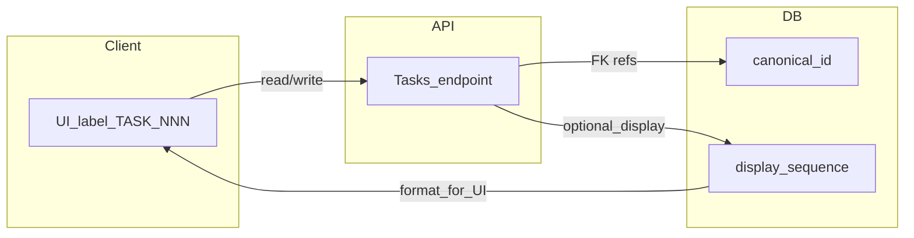

# 태스크 ID·넘버링 가이드

> 구현 전 설계 참고용. **시스템 식별자**와 **사람이 읽는 번호/표시 문자열**을 분리하는 권장 모델과, 이 레포에서 이미 겪은 충돌 사례를 연결한다.

## 관련 문서

- 사고 기록(동일 `TASK-NNN`·다른 slug): [docs/errors/2026-04-03-nightworker-task-id-collision.md](../errors/2026-04-03-nightworker-task-id-collision.md)
- 태스크가 UI·API·파일/엔진으로 흐르는 개요: [docs/prd/doc-task-workflow.md](../prd/doc-task-workflow.md)

## 1. 문제 정의

### `TASK-026` 형태를 “진짜 id”로 쓸 때의 한계

- **파싱 의존**: `TASK-` 접두어와 숫자를 문자열에서 떼어 써야 하며, 자릿수·포맷이 바뀌면 전부 수정된다.
- **충돌**: 동일 숫자 ID에 서로 다른 제목(slug)이 붙은 파일이 생기면, 목록·DB sync·UI에서 하나가 누락되거나 덮어쓰기가 발생할 수 있다. (위 오류 문서 참고.)
- **스코프**: 스프린트·보드·프로젝트가 나뉘면 “전역 TASK 번호”만으로는 의미가 모호해진다.
- **이관·연동**: 외부 시스템·URL·로그 상관관계에는 **불변·비추측**인 키(ULID/UUID 등)가 유리하다.

### `docs/task/`의 `id: TASK-NNN`과의 관계

- 저장소의 `docs/task/TASK-xxx-….md` 프론트매터 `id`는 **문서·브랜치·워크트리 네이밍 관례**로 쓰일 수 있다.
- 제품 DB나 API의 **canonical 식별자**와 **반드시 동일 개념일 필요는 없다.** 다만 마이그레이션 시 매핑 테이블·`legacy_ref` 등으로 연결해 두는 것이 안전하다.

## 2. 권장 모델

| 개념                               | 역할                         | 예시                                  |
| -------------------------------- | -------------------------- | ----------------------------------- |
| **canonical `id`**               | 불변. API·DB FK·로그·내부 URL 식별 | ULID, UUID, bigint PK               |
| `**sequence` / `displayNumber**` | 사람·정렬용 단조 번호               | 전역 `26` 또는 스프린트별 `3`                |
| **표시 문자열**                       | UI·문서 제목에만                 | `TASK-${String(n).padStart(3,"0")}` |

원칙:

- 저장·비교·참조는 **항상 canonical `id`**만 사용한다.
- `TASK-026` 같은 문자열은 **뷰에서 조합**하거나, 응답에 `displayLabel`/`humanId` 필드로 **부가 제공**한다.
- 표시 문자열을 **기본키·파일명 유일성의 유일 소스**로 삼지 않는다.

## 3. 넘버링 할당 규칙(선택지)

| 방식                 | 장점                | 단점                          |
| ------------------ | ----------------- | --------------------------- |
| **DB 시퀀스**         | 동시 생성에 강함, 단조 보장  | DB 종속                       |
| **트랜잭션 내 `MAX+1`** | 구현 단순             | 경쟁·락 설계 필요(과거 bash 락 이슈 참고) |
| **스코프별 카운터**       | 스프린트/보드 단위 번호에 적합 | 스키마에 스코프 키 필요               |

현재 엔진 SQLite 쪽은 `tasks.id`에 `TASK-NNN` 문자열을 넣고, 다음 ID는 `getNextTaskId()`로 **기존 id 문자열에서 숫자만 파싱**해 증가시키는 방식이다. ([packages/engine/src/service/task-store.ts](../../packages/engine/src/service/task-store.ts) — `getNextTaskId`.) 설계를 바꿀 때는 여기와 태스크 생성 호출부를 함께 검토한다.

## 4. 마이그레이션·공존

- 기존 행이 `TASK-NNN`만 있는 경우: `legacy_human_id` / `external_ref` 등으로 **옛 문자열 보존**, 신규 행부터 canonical `id` 도입.
- API: 하위 호환을 위해 기간 동안 `id`(신) + `legacyTaskKey`(구) 또는 `displayLabel`을 **병행 반환**할 수 있다.
- 클라이언트가 URL `/tasks/[id]`에 구 문자열만 가정하면, 리다이렉트 또는 slug 별칭 정책을 문서화한다.

## 5. 구현 체크리스트

변경 시 아래를 순서대로 점검한다 (실제 경로는 리포지토리 기준).

- **DB 스키마**: `tasks` 테이블 PK·인덱스·`depends_on` 등 JSON 내 참조 필드.
- **ID 발급**: [packages/engine/src/service/task-store.ts](../../packages/engine/src/service/task-store.ts)의 `getNextTaskId`, `createTask`.
- **태스크 생성 진입점**: [packages/engine/src/orchestrate/night-worker.ts](../../packages/engine/src/orchestrate/night-worker.ts) 등 `createTask` / `getNextTaskId` 호출부.
- **대시보드 API**: Next 라우트는 `@/service/task-store`로 엔진 구현을 import한다(`tsconfig` paths: `../engine/src/service/`*). 예: [packages/dashboard/src/app/api/tasks/](../../packages/dashboard/src/app/api/tasks/) — 실제 CRUD·`getNextTaskId` 구현은 [packages/engine/src/service/task-store.ts](../../packages/engine/src/service/task-store.ts).
- **URL·라우팅**: `app/tasks/[id]/` 등 동적 세그먼트가 canonical id를 받는지, 검색·필터 쿼리와 일치하는지.
- **로그·비용 파서**: `taskId` 문자열을 가정하는 테스트·파서 ([packages/engine/src/parser/task-log-parser.ts](../../packages/engine/src/parser/task-log-parser.ts) 등).
- **문서 태스크**: `docs/task/` 프론트매터 `id`와 브랜치 네이밍 스크립트(팀 관례).

과거 bash `night-worker.sh`의 `next_task_id()` 경쟁 이슈는 [nightworker 충돌 문서](../errors/2026-04-03-nightworker-task-id-collision.md)에 정리되어 있다. 엔진은 Node 포팅([packages/engine/src/cli/run-night-worker.ts](../../packages/engine/src/cli/run-night-worker.ts))을 사용하나, **“문자열 TASK 번호 단일 소스”**라는 구조적 리스크는 동일 계열로 이해하면 된다.

## 6. 비목표(첫 도입에서 생략 가능)

- 짧은 hash 전용 공개 URL과 긴 canonical id를 이중으로 운용하는 복잡한 단축 링크 체계.
- 전역 ULID만 노출하고 사람용 번호를 완전히 없애는 UX(제품 요구에 따라 재검토).

## 7. 데이터 흐름(요약)

- UI에 보이는 `TASK-026`은 **SEQ(또는 포맷 결과)**에서 파생.
- API·DB 내부 연결은 **PK**만 사용하는 것이 목표 상태다.

